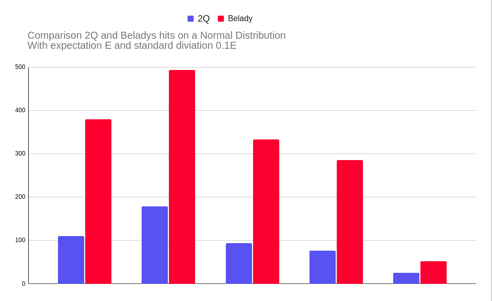
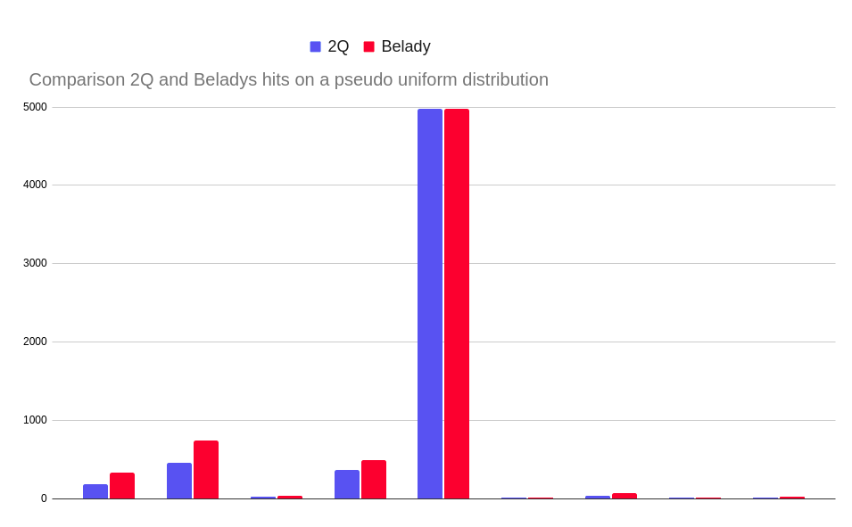

# How to build a project
```
  $ mkdir build
  $ cd build
  $ cmake ..
  $ make
```
---
---
### In a folder 'build' files 'cache', 'unTest' and 'belady' will appear executing a programm, her tests and Belady's algorithm respectively 
---
---
---
# Some words about the algorithm
### 2Q Cache is implemented with 2 queues (IN-OUT and HOT). There are the three points:
* New pages go to IN-queue
* When IN-Queue becomes overflow, its last element is displaces into OUT-queue
* When OUT-queue becomes overflow, its last element is vanished 

### If a new page P has already existed in a cache, we follow the next steps:
* If P has been found in the IN-Queue, we do nothing
* If P has been found in the OUT-Queue, we replace it in HOT-queue
* If P has been found in the HOT-Queue, we replace it at the start of this one
# Comparison with belady's algorithm
### Testing with a Normal Distribution shows an average 33,6% effeciency:
---
--- 
 

---
---
### Testing with a pseodo random distribution shows an average 55.8% effeciency:
---
---

