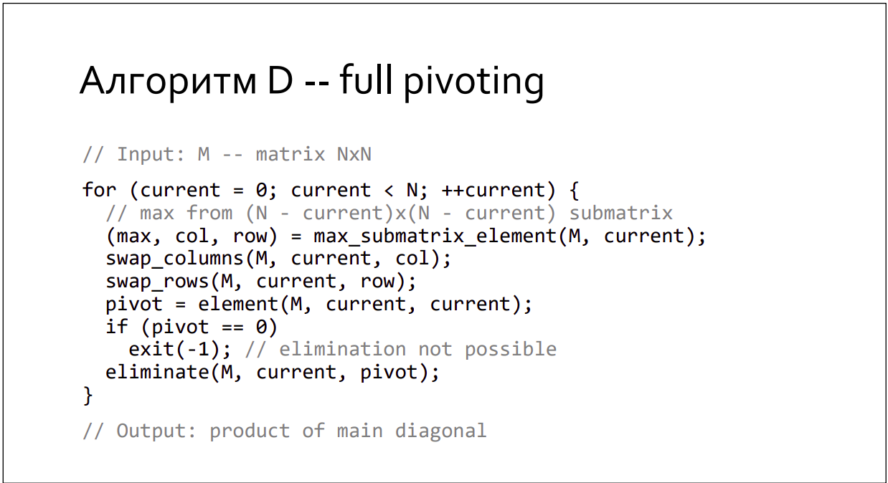

# How to build a project
```
  $ mkdir build
  $ cd build
  $ cmake ..
  $ make
```
---
---
## If you have some troubles with building the project, try to install GoogleTests:
#Ubuntu:
```
  $ sudo apt-get install libgtest-dev
  $ cd /usr/src/gtest
  $ sudo cmake CMakeLists.txt
  $ sudo make
```
#Arch:
```
  $ sudo pacman -S gtest
```

## Compiler settings:
```
  $ g++ -Wall -Wextra -Wpedantic -O2
```
---
---
### In a folder 'build' an executiable file 'matrix' and  test-file 'tests' will appear
---
## Input data: 
* **N** --- size of a square matrix
* **N** Numbers (integer or floating)  
## Output data: 
* The determinant of the matrix 
### ***example:*** 
**INPUT:** ---> << 2 1 0 1 0 >> ||^_^|| **OUTPUT:** ---> << 1 >>

--- 
---
# Useful materials: 

(C) C-graduate Konstantin Vladimirov
===================================================================================================

# Implemented by second-year MIPT student Belov Vladislav
